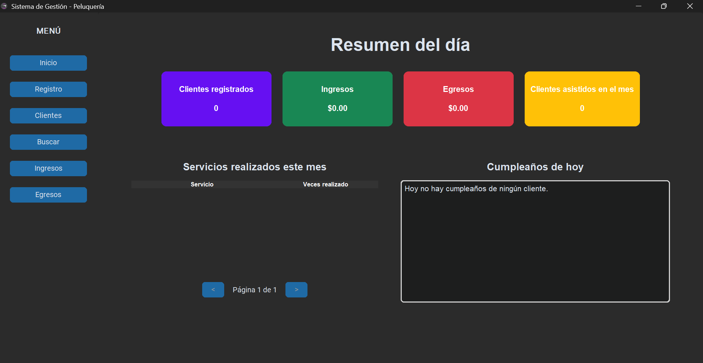

# ✂️ Sistema de Gestión para Peluquería

¡Bienvenido al **Sistema de Gestión de Peluquería**! Una aplicación de escritorio robusta y moderna desarrollada en Python, diseñada para digitalizar la administración de clientes, servicios, ingresos y egresos de un salón de belleza.

## 🚀 Características Principales

* **Panel de Resumen:** Visualización rápida de clientes registrados, ingresos totales, egresos y servicios realizados en el mes actual.
* **Gestión de Clientes:** Registro detallado de clientes y visualización de fichas individuales con su historial completo de servicios.
* **Control Financiero:** Módulos específicos para el seguimiento de ingresos y egresos con cálculos automáticos.
* **Búsqueda Avanzada:** Filtros dinámicos para encontrar servicios o clientes por nombre o fecha.
* **Exportación a PDF:** Generación de reportes profesionales para fichas de clientes y listados financieros utilizando `ReportLab`.
* **Paginación:** Tablas optimizadas con paginación para un manejo fluido de grandes volúmenes de datos.
* **Notificaciones de Cumpleaños:** Sección dedicada para visualizar quiénes cumplen años en el día actual.

## 🛠️ Tecnologías Utilizadas

* **Lenguaje:** Python 3.14
* **Interfaz Gráfica (GUI):** [CustomTkinter](https://github.com/TomSchimansky/CustomTkinter) (para un diseño moderno y modo oscuro/claro).
* **Base de Datos:** SQLite3 (base de datos relacional local).
* **Reportes:** ReportLab (generación de documentos PDF).
* **Gráficos:** Matplotlib (visualización de datos financieros).
* **Procesamiento de Imágenes:** Pillow (manejo de iconos y logos).
* **Empaquetado:** PyInstaller (para convertir el proyecto en un ejecutable `.exe`).

## 📋 Estructura del Proyecto

```text
├── inicio.py          # Ventana principal y lógica de navegación (Main)
├── database.py        # Gestión de la base de datos SQLite y consultas
├── registro.py        # Formulario de registro de nuevos clientes
├── clientes.py        # Listado general de clientes y exportación PDF
├── buscar.py          # Filtros y búsqueda de servicios realizados
├── ingresos.py        # Visualización y estadísticas de ingresos
├── egresos.py         # Gestión de gastos del negocio
├── ver_ficha.py       # Historial detallado por cliente
├── logo.ico           # Identidad visual de la aplicación
└── peluqueria.db      # Base de datos local
```

## ⚙️ Instalación y Ejecución

Si deseas ejecutar el código fuente para desarrollo:
1. Clonar el repositorio:
   ```text
   git clone [https://github.com/Maicol843/App_Peluqueria.git](https://github.com/Maicol843/App_Peluqueria.git)
    cd App_Peluqueria
  
2. Instalar dependencias:
   ```text
      python -m pip install customtkinter pillow matplotlib reportlab
   ```
3. Ejecutar la aplicación:
   ```text
     python inicio.py
    ```

## 📦 Generación del Ejecutable (.exe)

Para crear una versión portable para Windows:
```text
    python -m PyInstaller --noconsole --onefile --icon="logo.ico" --name "SistemaPeluqueria" inicio.py
```
Nota: Asegúrate de incluir el archivo logo.ico y peluqueria.db en la misma carpeta que el .exe generado en la carpeta dist.

<p align="center">
  
</p>

#
Desarrollado por Maicol Daniel Mamani Chalco
